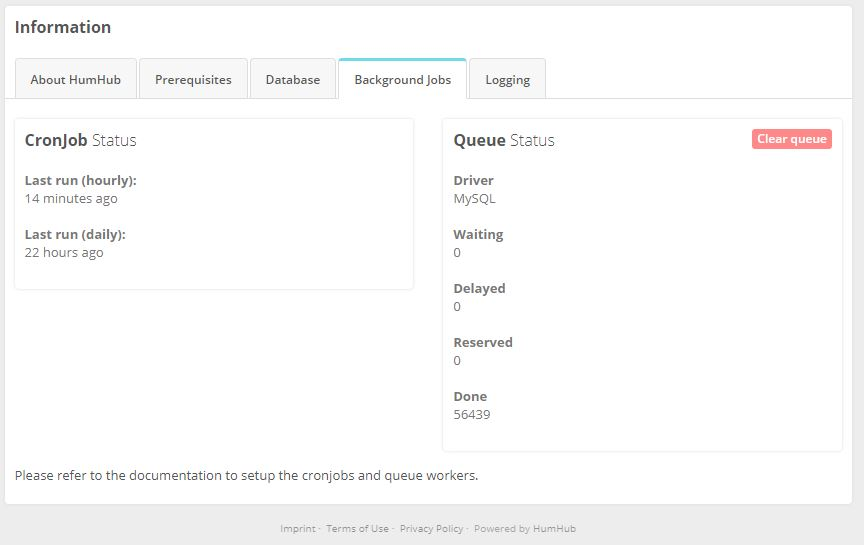

Asynchronous jobs in HumHub are used to run potentially heavy or scheduled tasks such as sending out summary mails,
notifications or search index optimization. The following section describes how to setup automatic job execution 
required to handle such jobs. Since those settings are highly dependent on your server environment we can't assure 
those setting will work for your. If you have trouble setting up the job scheduling described in this guide, please
contact your provider to ask for support.

## Overview

There are two commands which needs to be scheduled:

 - **CronJob** - `cron/run`
 - **Queue** - `queue/run`

### `cron/run`

The cron command is used to run **scheduled jobs** which for example need to be executed hourly or daily. You can
manually execute the cron command as follows:

```console
php /path/to/humhub/protected/yii cron/run
```

### `queue/run`

The queue command is used to run **asynchronous jobs** which are potentially long running and therefore need to
be executed in the background. The queue can either be scheduled as CronJob (see below) or with the help of another job-runner like 
for example [Supervisor](http://supervisord.org/) or [Systemd](https://www.freedesktop.org/wiki/Software/systemd/). 
Please refer to the [Asynchronous Tasks](asynchronous-tasks.md) section for more details about queuing and job processing.

The queue command can be executed manually as follows:

```console
php /path/to/humhub/protected/yii queue/run
```


## CronJob configuration

As mentioned before, the CronJob configuration highly depends on your server environment. The following section is meant
to help you with the CronJob setup and includes a guide for some common environments.

If you are **not** using any other job-runner like _Supervisor_ or _Systemd_ for your queue, both commands can
be scheduled as CronJob. Otherwise only the main `cron/run` command needs to be scheduled as CronJob. 


**CronTab example**

```console
* * * * * /usr/bin/php /path/to/humhub/protected/yii queue/run >/dev/null 2>&1
* * * * * /usr/bin/php /path/to/humhub/protected/yii cron/run >/dev/null 2>&1
```

:::important
If you're on a **shared hosting environment**, you may need to add the `--isolate=0` option to the `queue/run`
command e.g. `/usr/bin/php /path/to/humhub/protected/yii queue/run --isolate=0`.
:::

:::caution
Make sure to use the right [php cli executable](http://php.net/manual/en/features.commandline.introduction.php) for your jobs!
:::

### CloudLinux (CentOS) 6

The following is a default setup for CloudLinux (CentOS) 6 and may not work for all users.

```console
/usr/local/bin/php /home/USERNAME/public_html/WEB-DIRECTORY/protected/yii cron/run >/dev/null 2>&1

* * * * *

/usr/local/bin/php /home/USERNAME/public_html/WEB-DIRECTORY/protected/yii queue/run >/dev/null 2>&1

* * * * *
```

### cPanel Hosted Server

The following is a default setup for cPanel Hosted Server and may not work for all users.

```console
/usr/local/bin/php /home/USERNAME/public_html/WEB-DIRECTORY/protected/yii cron/run >/dev/null 2>&1

* * * * *

/usr/local/bin/php /home/USERNAME/public_html/WEB-DIRECTORY/protected/yii queue/run >/dev/null 2>&1

* * * * *
```

### IIS Windows Server

Using [Schtasks](https://docs.microsoft.com/en-us/windows-server/administration/windows-commands/schtasks) would be recommended over many other options for Windows 2012 and Windows 8 users.

### Plesk

Refer to this [post](https://stackoverflow.com/questions/16700749/setting-up-cron-task-in-plesk-11)


### OVH

[Follow this link](https://www.ovh.com/us/g1990.hosting_automated_taskscron)

Create the following files then follow the above link.

`cronh.php`

```php
`<?php $humhubh = '/usr/local/php8.2/bin/php '.__DIR__.'/protected/yii cron/run '; exec($humhubh); ?>`
```


`crond.php`

```php
<?php $humhubd = '/usr/local/php8.2/bin/php '.__DIR__.'/protected/yii queue/run '; exec($humhubd); ?>
```

### Debian

See also [CronJob Setup](installation.md#cronjobs).

Please read up on this [article](https://debian-administration.org/article/56/Command_scheduling_with_cron).


### Ubuntu

See also [CronJob Setup](installation.md#cronjobs).

Please read up on this [how-to guide](https://help.ubuntu.com/community/CronHowto).


## Status and Troubleshooting

In case you encounter any issues with the job execution like unsent notifications or summary mails you can check
the job status under `Administration -> Information -> Background Jobs`. Ideally the `Last run` time of the *CronJob Status*
should be set and updated regularly. The value `Waiting` of *Queue Status* should decrease or be empty, 
while the `Done` value increases.



Troubleshooting can be done by checking the usual backend logs under `Administration -> Information -> Background Jobs` 
as well as using the following cron configuration to log the output of the command to a `queue.log` and `cron.log` file:

```
* * * * * /usr/bin/php /path/to/humhub/protected/yii queue/run >/path/to/queue.log 2>&1
* * * * * /usr/bin/php /path/to/humhub/protected/yii cron/run >/path/to/cron.log 2>&1
```

The log output may give you some hints about the problem and ideally should either be empty or filled with some stats if
the job ran correctly. The modification time of the file furthermore informs you about the last time the cron job ran.
