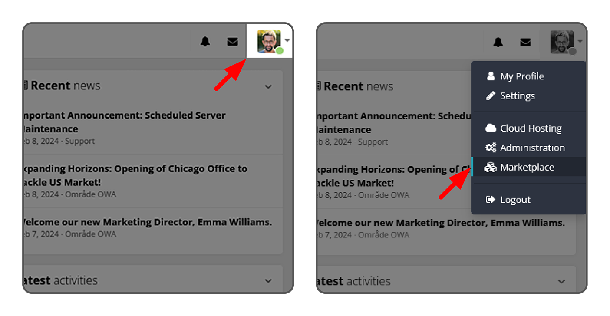
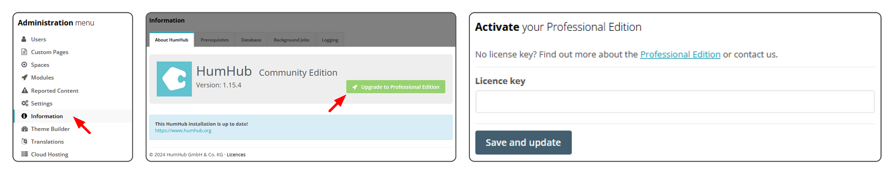
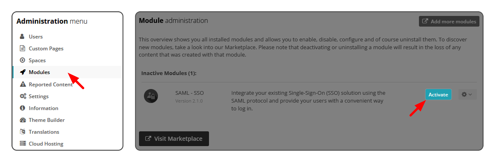
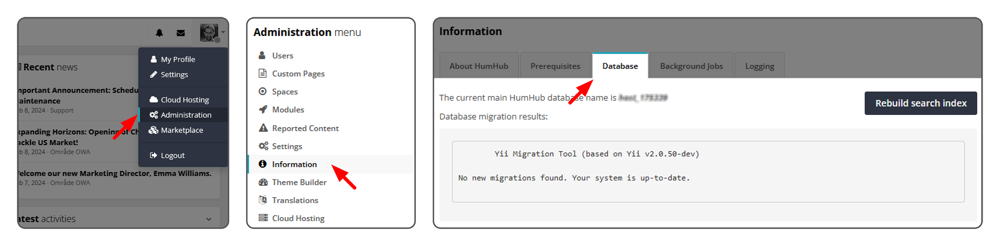
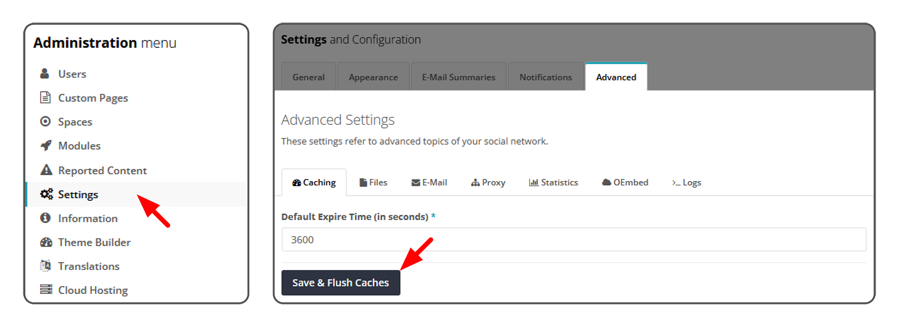

## HumHub Marketplace
HumHub utilizes a modular system for customization, enhanced stability, and versatility to accommodate various individual use cases. The HumHub Marketplace provides a wide array of modules, including official, partner, and community-contributed ones.

### Installing Modules
Modules can be easily installed through HumHub's integrated marketplace. To browse, install, and activate modules, navigate to **Profile Dropdown > Marketplace**.

### Installing purchased Modules
To activate a license for individually purchased modules, navigate to **Marketplace > Settings > Add License Key**. After adding the license key, the module will be available for installation.

### Activating & Installing Modules of the HumHub Professional Edition
To activate HumHub Professional Edition, navigate to **Administration > Information > Upgrade to Professional Edition**. After activation, all Professional Edition modules will be available for installation on the Marketplace.

### Installing Modules manually
Modules available in the integrated marketplace can also be sourced from the [HumHub Marketplace](https://marketplace.humhub.com/). This includes both paid Professional Edition modules and free modules. These modules, including custom modules or those not available in the official Marketplace, can be manually installed by uploading the module `module_name.zip` and unpacking it into the `protected/modules` directory (or even better in a separated path, [see Module Loader Path](https://docs.humhub.org/docs/develop/environment#module-loader-path)).

> **Note:** It is recommended to use a separate path for custom/unofficial modules. Refer to [Module Loader Path](https://docs.humhub.org/docs/develop/environment/#module-loader-path).

After unpacking the custom module into the directory, navigate to **Administration > Modules** and activate the module.

**Updating modules manually:**
1. Unpack the `module_update.zip` file and overwrite the original files with new ones.
2. Navigate to **Administration > Information > Database** to perform possible database migrations.

3. Navigate to **Administration > Settings > Advanced** and click the **Save & Flush Caches** button.

## Firewall / Whitelist

If the HumHub server does not have a direct or filtered internet connection, the following options are available:

- Setup a HTTP Proxy Server (`Administration` -> `Settings` -> `Advanced` -> `Proxy`).

- Whitelist HumHub API Endpoints. Following hosts `www.humhub.com` and `api.humhub.com` must be accessible with HTTPS (443) protocol.

- Disable Outgoing Marketplace connections. [See configuration options](config-options.md#marketplace)
