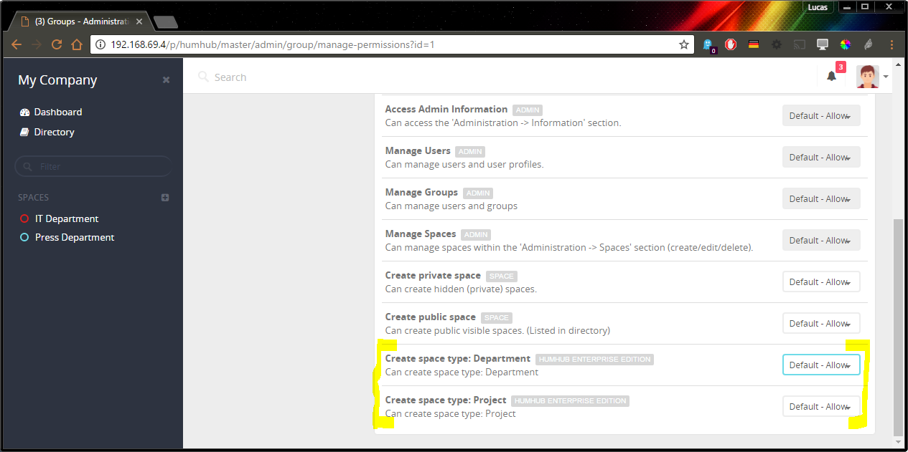
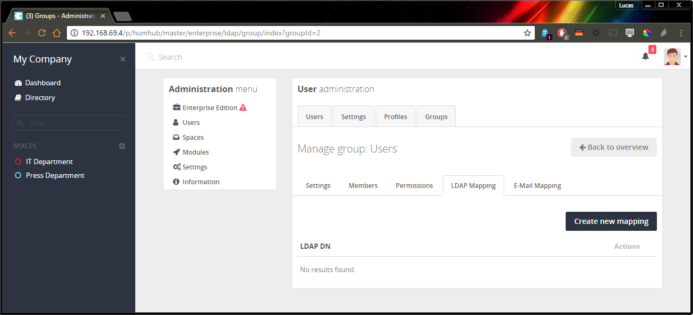
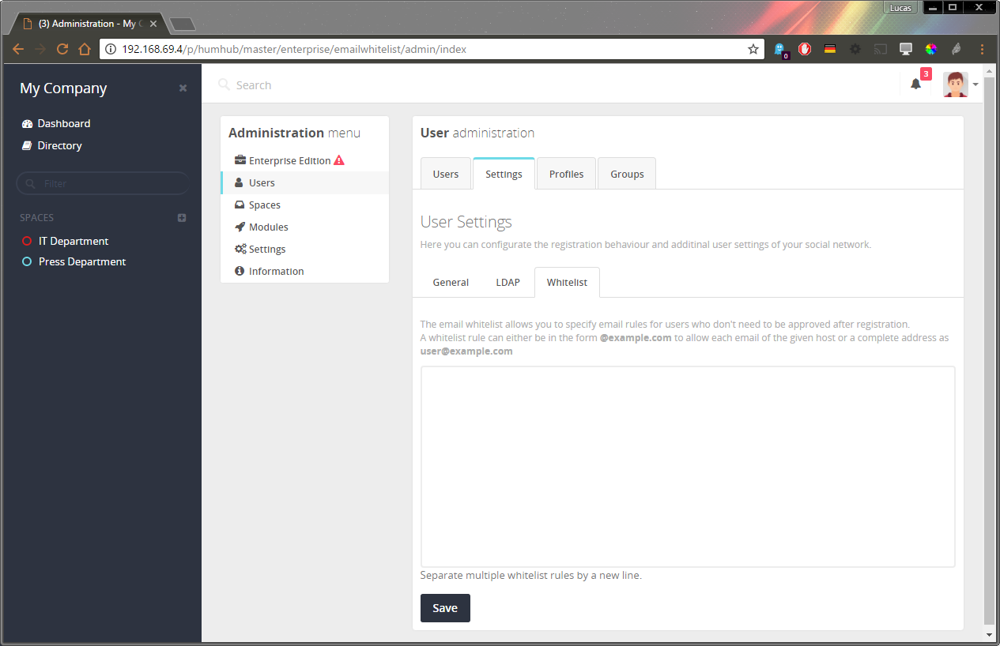

:::warning
This page contains the documentation of the legacy Enterprise Edition.
:::


## Migrate to Professional Edition 

Upgrading from the **Enterprise Edition** to the **Professional Edition** is unproblematic. However due to many changes from version 1.3.X to version 1.4, it requires some effort. 
If you follow these steps, you should get this done with ease:

 
1. Create a **BACKUP** of you installation an your database **IN EVERY CASE**

2. Update to the latest HumHub and "Enterprise Edition" module available (`Administration -> Modules`) 

3. Active your **Professional Edition** license key (`Administration -> Information -> "Upgrade to Professional Edition"`)

4. Switch to the default theme named **HumHub** (`Administration -> Settings -> Appearance`)

5. If you're using any Enterprise Edition features, which require a config file entry e.g. [SOLR search](https://marketplace.humhub.com/module/solr) or [JWT SSO](https://marketplace.humhub.com/module/jwt-sso), either comment those parts out or remove them completely.

6. Disable and _uninstall_ the module "Humhub Enterprise Edition"

7. Use to HumHub Marketplace (`Administration -> Modules -> Browse online`) to install and activate the **HumHub - Professional Edition** features you want to use e.g. [Enterprise Theme](https://marketplace.humhub.com/module/enterprise-theme) or [Advanced Ldap](https://marketplace.humhub.com/module/advanced-ldap).

8. Revert to your usual Theme (`Administration -> Settings -> Appearance`)

9. Some Professional Edition modules like [SOLR search](https://marketplace.humhub.com/module/solr) or [JWT SSO](https://marketplace.humhub.com/module/jwt-sso) may require updates to the configuration. You will find detailed instructions each module in our [Marketplace](https://marketplace.humhub.com)


## Installation

There are two options to obtain the **HumHub** Enterprise Edition.

**Option 1: Marketplace Installation**

If you have already installed the HumHub Community Edition, please follow the steps below to enable the Enterprise Edition.

- Login as Administrator
- Click to: `Administration` -> `Modules` -> `Browse Online`
- Select Enterprise Edition: `Install` 
- Switch to the `Installed modules` tab on the `Modules directory` site
- Select Enterprise Edition: `Enable` 
 
** Activate Enterprise Edition: **

Once installed, you can enter your licence key at: `Administration` -> `Enterprise Edition` .

The [Enterprise Theme](https://marketplace.humhub.com/module/enterprise-theme) can be selected under `Administration` -> `Settings` -> `Appearance`.

**Option 2: Download Package**

You can also download a prebuilt package at: https://download.humhub.com

Please see the [Installation Guide](../admin/installation.md) for further information.

## Updating


The HumHub Enterprise Edition is delivered as module package in addition to the standard community edition.

Like any other module, available updates are displayed at: `Administration` -> `Modules` -> `Available updates`. 

> Info: You also need to keep the **HumHub** core platform up to date - More information: [Updating HumHub](../admin/updating.md)


## Features


### Enterprise Theme

You can enable the **HumHub** Enterprise Edition - Theme by following steps:
- Navigate to: `Administration` -> `Settings` -> `Appearance`
- Select `enterprise` in the Theme dropdown menu
- Click `Save`


#### Theme Customization

> Note: This chapter only describes the differences between the [standard theming](../theme/overview.md) and the `Enterprise Edition`.

** Create custom Enterprise theme copy **

The original enterprise theme is typically located at: `protected/modules/enterprise/themes/enterprise`

Steps:
1. Copy this folder to e.g. `themes/MyEnterprise`.
2. Make sure to set `$baseTheme: "enterprise";` or `$baseTheme: "enterprise-white";` in the `scss/variables.scss` file.
3. Activate it in `Administration -> Settings -> Appearance`

** Additional Sass variables **

Variables starting with `$hh-et-` are specific to the Enterprise Theme.

See file `themes/enterprise/scss/variables.scss` to get the list of these variables.
  
> Note: Your theme might need to be migrated if a new HumHub or enterprise version comes out. This will not affect your custom themes thus your theme views might overwrite essential changes made in the HumHub views. To migrate your theme check the differences between your custom theme files (views, js, scss) and the enterprise default theme files and adopt necessary changes.


### Space Types

Space types allows you to separate spaces into different categories (e.g. Department Spaces or Project Spaces).


**Define Space Types**

You can create new space types at: `Administration` -> `Spaces` -> `Types`


**Restrict Space Creation**

It's also possible to restrict Space creation by user groups.

You can define these permission at: `Administration` -> `User` -> `Groups` -> `Select group` -> `Permissions`



### LDAP


The **HumHub** Enterprise Edition provides some advanced LDAP features.

#### User Mapping

You can assign user's group or space memberships automatically using LDAP configuration.

The mapping can be used by:

- User LDAP group memberships (memberOf field, e.g. CN=xyz_space_access,OU=Groups,DC=example,DC=com)
- The part of the users base DN (e.g. OU=People,DC=example,DC=com)
- Attribute values (e.g. street==Some Street or street=~Street)

> Note: The mapping is handled by the hourly cron job and may takes some time to affect.

#### Space Mapping

As administrative user, you can map a LDAP group directly to a space. 

Configuration page: `Open Space` -> `Members` -> `LDAP`


#### Group Mapping

As administrative user, you can map a LDAP group against HumHub groups which are mainly used for administrative tasks. 

Configuration page: `Administration` -> `Users` -> `Groups` -> `Select a group` -> `LDAP`




#### Profile Images

You can also synchronize profile image from LDAP.

Modify your local configuration `protected/config/common.php` and add following section:

```php
<?php

return [
    'components' => [
        'authClientCollection' => [
            'clients' => [
                'ldap' => [
                    'class' => 'humhub\modules\enterprise\modules\ldap\authclient\ZendLdapClientEnterprise',
                    'profileImageAttribute' => 'thumbnailphoto'
                ]
            ]
        ]
    ]
];
```


### Solr

Follow [the module installation guide](https://marketplace.humhub.com/module/solr/installation).


### JWT

JWT SSO provides a single sign own mechanism to automatically log in your users by a JWT Token.

More information:
- https://jwt.io/
- [RFC 7519](https://tools.ietf.org/html/rfc7519)


#### Installation

1.) Install JWT endpoint 
You can find some example scripts at: protected/modules/enterprise/modules/jwt/examples.

2.) Add following configuration to /protected/config/common.php

```php
return [
    // ...
    'components' => [
        // ...
        'authClientCollection' => [
            'clients' => [
                // ...
                'jwt' => [
                    'class' => 'humhub\modules\enterprise\modules\jwt\authclient\JWT',
					'url' => 'Enter your JWT endpoint url here',
                    'sharedKey' => 'Enter your shared key here',
					// Other configuration options
                ],
            ],
        ],
        // ...
    ],
    // ...
];
```

#### Advanced configuration

Example with all possible configuration options:

```php
'jwt' => [
    'class' => 'humhub\modules\enterprise\modules\jwt\authclient\JWT',
    'url' => 'https://ntlm.example.com/jwtclient/index.php',
    'sharedKey' => 'XKqSoxWRcLVDtveMbhQ3oxgvogWT2ef3KpKLOF_gZgwTJyznr6UDi2SCWgSeaEUo5T1_bBYbR_blojv94Sr523zDQ_CzTETN4gMYyx6xU4hsF6HGnCdoFwmd9rOTY5MiIdGX1wdwP3FvpyS0bbmG17xfTtU87gySiQaJjQWq9J2SdLOu73xPej5l1k5BA2ab-taXogZi-STi1q30w0T0kU3SGJ-fYSZO5lGNI3pws313oh83Wby8IJxhS9GZjLjOHpMO7rveoUHE6cGOXm8SjuxsJTfChPl3sGhiA2Wc-cJ-uKaN37T7qQxKeZNjXFtNGTbXwOhXbtELP_ZUy66zPg',
    // Other configuration options
    // Title of JWT Button (if autologin is disabled)
    'title' => 'Company SSO Login',
    // Automatic login, when allowed IP matches
    'autoLogin' => true,
    // Limit allowed JWT IPs
    'allowedIPs' => ['192.168.69.1', '192.168.1.*'],
    // Leeway (seconds) for token validation
    'leeway' => 660,
],
```


### E-Mail Whitelisting

The email whitelist feature allows you to specify email rules for users who don't need to be approved after registration. 

You can define these rules at: `Administration` -> `Users` -> `Settings` -> `Whitelist`.




### E-Mail Groupmapping

The email mapping feature allows you to specify email rules for users which will be automatically assigned to a specified group after registration.

You can define these rules at: `Administration` -> `Users` -> `Groups` -> `Select a group` -> `E-Mail Mapping`.


