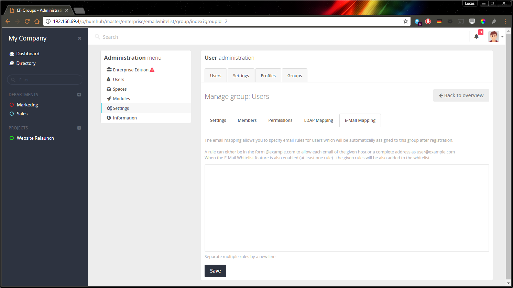

E-Mail - Group Mapping
======================

The email mapping feature allows you to specify email rules for users which will be automatically assigned to a specified group after registration.

You can define these rules at: `Administration` -> `Users` -> `Groups` -> `Select a group` -> `E-Mail Mapping`.

