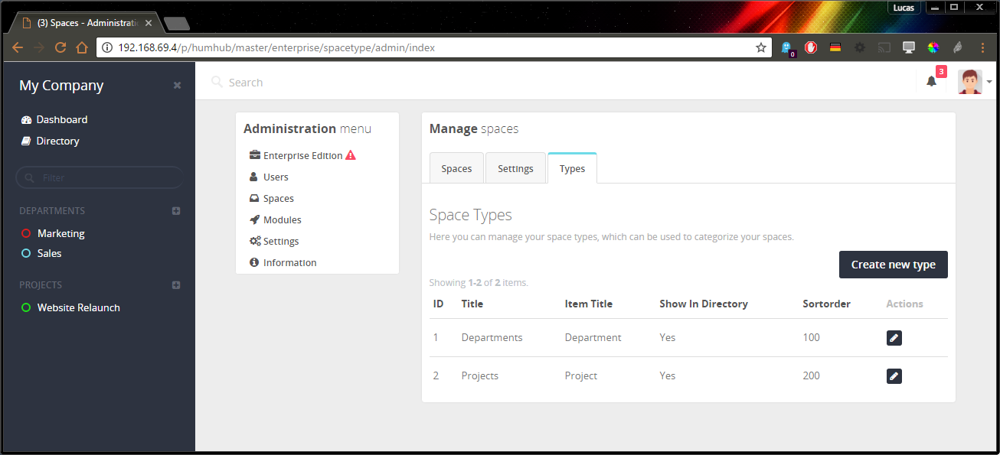

Space types allows you to separate spaces into different categories (e.g. Department Spaces or Project Spaces).

Define Space Types
------------------

You can create new space types at: `Administration` -> `Spaces` -> `Types`

Restrict Space Creation
-----------------------

It's also possible to restrict Space creation by user groups.

You can define these permission at: `Administration` -> `User` -> `Groups` -> `Select group` -> `Permissions`

