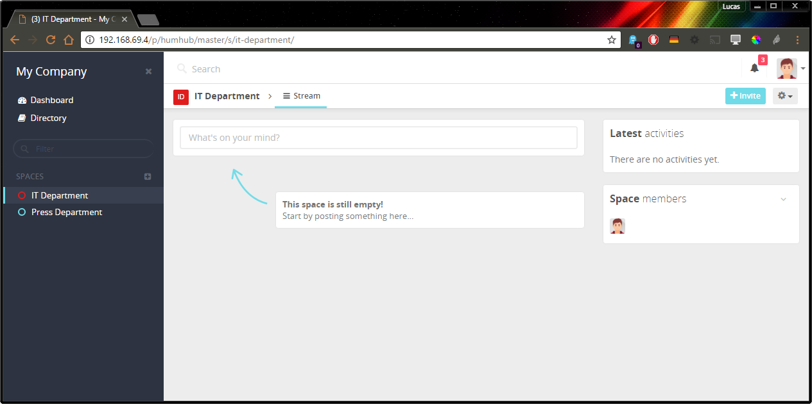

Enable the Enterprise Theme
---------------------------

You can enable the **HumHub** Enterprise Edition - Theme by following steps:
- Navigate to: `Administration` -> `Settings` -> `Appearance`
- Select `enterprise` in the Theme dropdown menu
- Click `Save`

Theme Customization
-------------------

> Note: This chapter only describes the differences between the [standard theming](../theme/overview.md) and the `Enterprise Edition`.

** Create custom Enterprise theme copy **

The original enterprise theme is typically located at: `protected/modules/enterprise/themes/enterprise`

You can simply copy this folder to e.g. `themes/MyEnterprise` and activate it in the administration menu.

** Before LESS compilation **

To (re-)build your themes less files, make sure to modify the path variables `@HUMHUB` and `@ENTERPRISE` in the file e.g. `themes/MyEnterprise/less/build.less` before.

- `@HUMHUB` - the absolute system path to the directory e.g. `/var/www/humhub/static/less`
- `@ENTERPRISE` - the absolute system path to the enterprise edition directory e.g. `/var/www/humhub/protected/modules/enterprise`

** Additional LESS variables **

- `@ee-sidebar-width` - the width of the left sidebar (defaults to: 250px)
- '@ee-sidebar-elements-color' - the secondary color which is used for icons and space type titles
  
> Note: Your theme might need to be migrated if a new HumHub or enterprise version comes out. This will not affect your custom themes thus your theme views might overwrite essential changes made in the HumHub views. To migrate your theme check the differences between your custom theme files (views, js, less) and the enterprise default theme files and adopt necessary changes.
